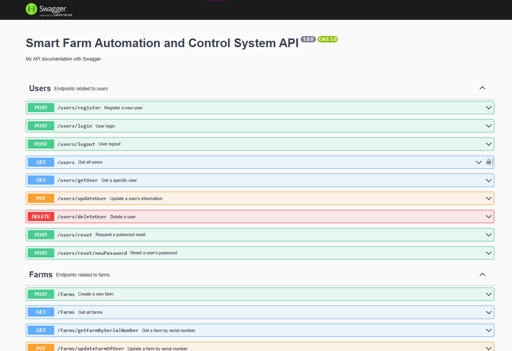
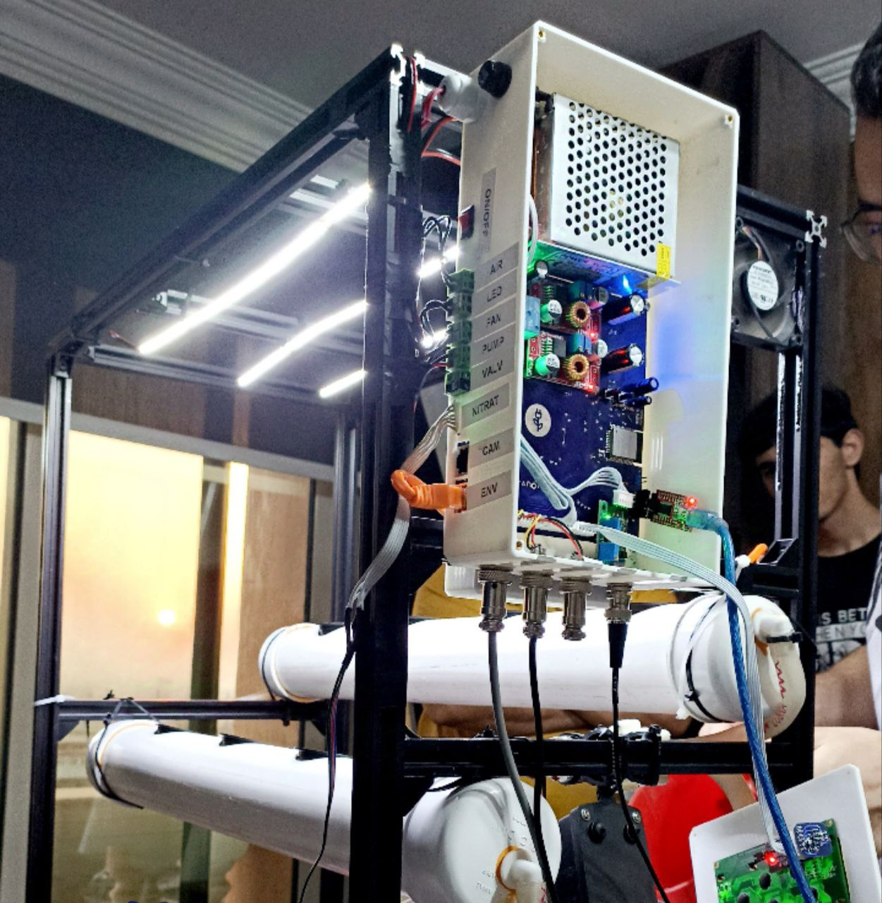
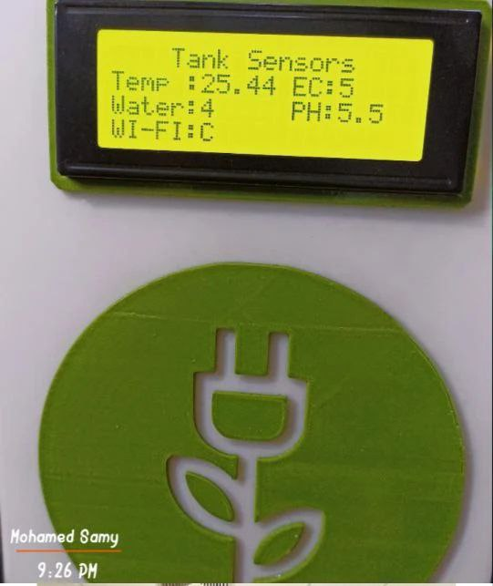
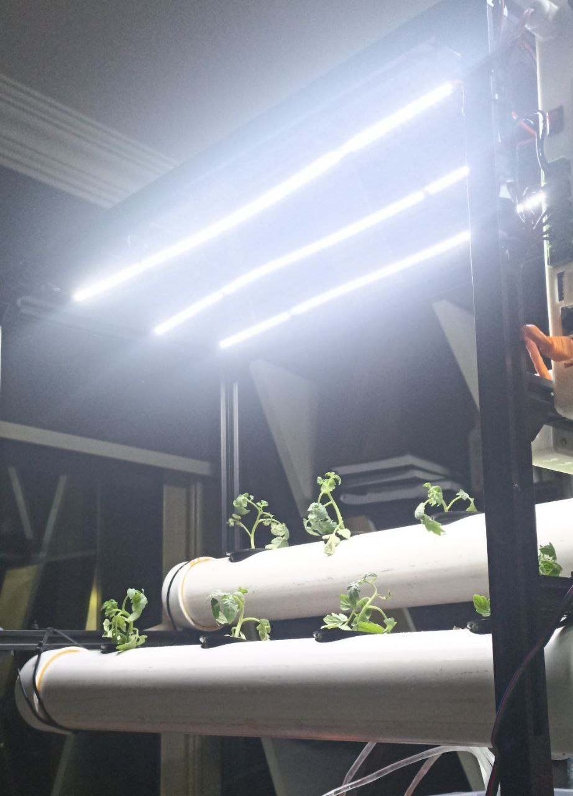
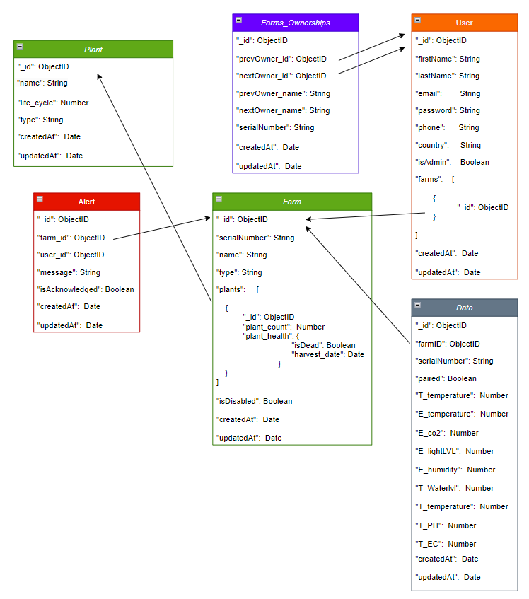

# Smart Farm: Automation and Control System

**Smart Farm** is an innovative farm automation and control system designed to enhance plant growth by monitoring environmental conditions and adjusting them in real-time. The system utilizes IoT devices, sensors, and automated systems to optimize farm productivity and sustainability.

---

## Documentation

The API for Smart Farm is fully documented using **Swagger**. You can view the documentation and explore the available endpoints by following the link below:

[Smart Farm API Documentation](https://sfc.onrender.com/docs/)(assets/documentationSwagger.jpg)


---

## Features of the application
- **Automated Irrigation**: Watering system triggered based on soil moisture levels.
- **Environmental Monitoring**: Real-time tracking of temperature, humidity, and light conditions.
- **Data-Driven Insights**: Comprehensive data analytics for farm optimization.
- **Mobile App Integration**: Control and monitor the farm remotely via the mobile app.

---

## Screenshots

### Smart Farm Device Body
This is the main body of the smart farm device, housing all the sensors and controllers that interact with the farm’s environment.



### Tank Sensor Readings
The system continuously tracks the temperature's water levels and other crucial metrics to ensure the plants receive the proper amount of water.



### Device at Work with Light for Plant Growth
The smart farm device uses lighting systems to supplement natural sunlight, enhancing plant growth even during low light conditions.



### Non-Relational Database Schema design


---

## Installation and Usage

Follow the steps below to set up Smart Farm on your local machine:

1. **Clone the Repository**
   ```bash
   git clone https://github.com/your-username/smart-farm.git
   cd smart-farm

2. **Install Dependencies Install the required Node.js dependencies:**
   ```bash
   npm install

3. **Run the Application in Development Mode Start the app locally:**
   ```bash
   npm start

